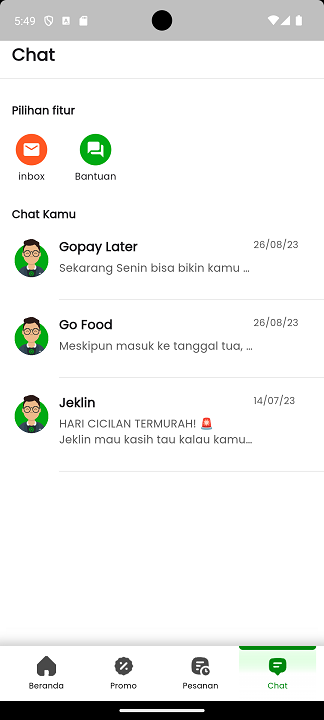
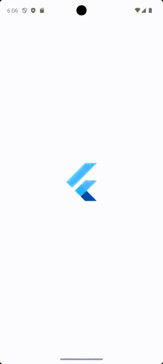

# Project_UAS_Rifki

Project ini dibuat untuk pemenuhan penyelesaian UAS - Mobile Programming.

Nama    : Rifki Dwi Ardianto

NIM     : STI202102552

Tugas   : Assignment UAS

Project ini dibuat untuk memenuhi penyelesaian UAS.
Dimana penugasannya untuk membuat clone apps dari sumber Play Store, dan app yang saya pilih yakni aplikasi "Gojek" sebagai penyelesaian tugas UAS.
Berikut linknya dalam Play Store :

<a href="https://play.google.com/store/search?q=gojek&c=apps">Link Gojek</a>

Dalam aplikasi clone gojek pada tampilan home yang dibuat sesuai dengan saat ini di bulan Mei 2024 waktu promo Gojek Plus jadi berbeda dengan tampilan yang ada di play store menggunakan navigasi yang menampilkan layar Home, Promo, Pesanan dan Chat.
untuk widget yang digunakan adalah StatelessWidget

Tampilan Home - Promo - Pesanan - Chat

